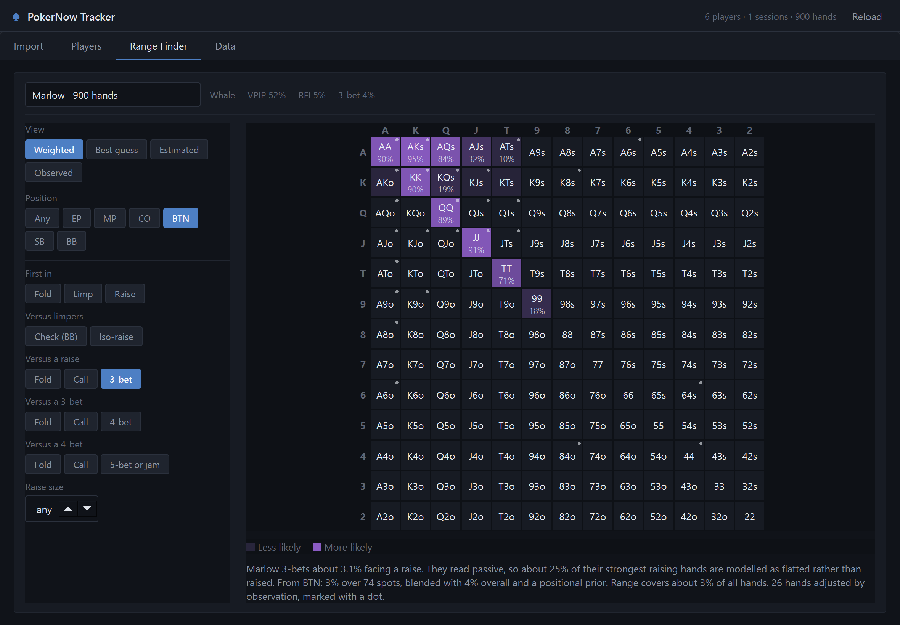
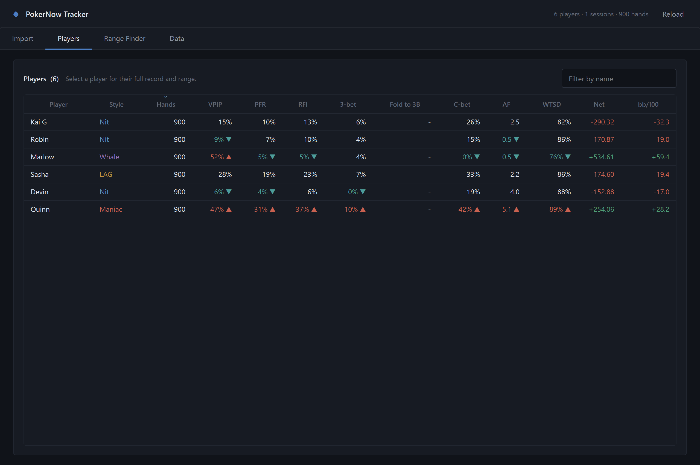
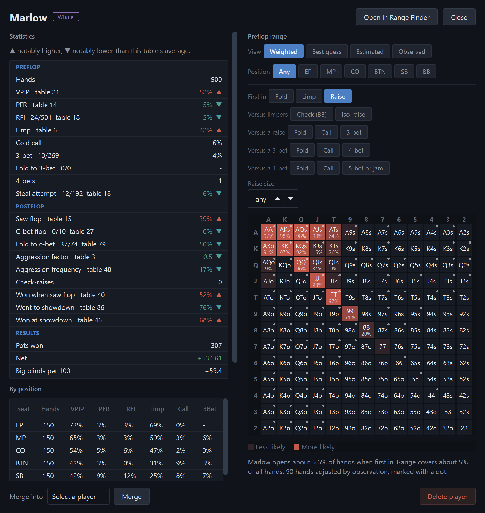

# PokerNow Tracker

A desktop tracker and preflop range analyser for [PokerNow](https://www.pokernow.club/) games. It reads the hand-history exports PokerNow already produces and turns them into per-player statistics, positional splits, results, and probabilistic range estimates.



Pick a player, a seat, and a preflop action, and every starting hand is shaded by how likely it is to be in their range. A dot marks a hand whose estimate was adjusted by cards you have actually seen.

## Contents

- [Download](#download)
- [Getting started](#getting-started)
- [The application](#the-application)
- [Statistics](#statistics)
- [Range estimates](#range-estimates)
- [How the range model works](#how-the-range-model-works)
- [Where data is kept](#where-data-is-kept)
- [Development](#development)
- [License](#license)

## Download

**[Get the latest version here.](https://github.com/goodsellkai/pokernowtracker/releases/latest)** Pick the file that matches your computer, then open it. There is nothing to install, no Python to set up, and no terminal at any point.

| Your computer | File to download |
| --- | --- |
| Windows | `PokerNow Tracker.exe` |
| Mac with Apple silicon (M1 and later) | `PokerNow-Tracker-macOS-AppleSilicon.zip` |
| Mac with an Intel processor | `PokerNow-Tracker-macOS-Intel.zip` |

On a Mac, double-click the downloaded `.zip` to unpack it, then drag `PokerNow Tracker` into your Applications folder.

### The first time you open it

Your computer will warn you that the application comes from an unidentified developer. That warning appears for anything not signed through a paid developer programme, and it is not a sign that something is wrong.

- **Windows** shows a blue "Windows protected your PC" box. Click **More info**, then **Run anyway**.
- **macOS** says the app "cannot be opened because the developer cannot be verified". Right-click (or Control-click) the app, choose **Open**, then **Open** again in the box that follows. You only have to do this once.

## Getting started

1. In PokerNow, open the game and click **Log** at the bottom right.
2. Click **Download** at the top of the log panel. Your browser saves a `.csv` file.
3. Drag that file onto the **Import** tab.
4. Open **Players** to see everyone at your table, or **Range Finder** to ask what somebody is holding.

Import each game when it finishes, and the reads keep sharpening.

Statistics accumulate across every log you import. Players are matched by their PokerNow account id, so a changed nickname carries over, and players whose names differ only in case or spacing are merged automatically. Re-importing a log you have already processed is safe, because hands are deduplicated by hand id. Importing a longer export of a game you already have replaces the shorter one.

## The application

**Import** takes hand histories by drag and drop or through a file picker, and reports what each file added.

**Players** lists everyone tracked in a sortable table. Statistics that sit well away from the table average carry an arrow, so the reads are relative to the game you actually play in rather than to a generic population. Selecting a row opens that player's full record.



**Range Finder** is the screenshot at the top of this page.

**Data** shows where everything is stored and what is archived, and offers a rebuild, a JSON backup, a reset, and a control for moving the data folder somewhere else.

A player's window holds their complete statistics, positional splits, and session history beside their range, along with notes, a tag, and merge and delete controls.



## Statistics

| Category | Metrics |
| --- | --- |
| Preflop | VPIP, PFR, RFI, limp, cold call, 3-bet, fold to 3-bet, 4-bet, steal attempt |
| Postflop | Saw flop, flop c-bet, fold to c-bet, aggression factor, aggression frequency, check-raises, won when saw flop, went to showdown, won at showdown |
| Results | Pots won, net winnings, big blinds per 100 hands, per-session history |

Every ratio is measured against genuine opportunities rather than against all hands, so a 3-bet percentage is not diluted by hands where nobody raised first. Preflop metrics are also broken out by seat.

Players are classified once they reach a 20-hand sample. The parser handles blinds, straddles, missed and missing blind posts, all-in actions, run-it-twice, rebuys, dead-button hands, cards shown voluntarily after folding, and players who act while absent from the stacks line. Money is reconciled per hand and verified to sum to zero across the table. Heads-up hands are excluded, since heads-up ranges are wide enough to distort a full-ring sample.

## Range estimates

The complete preflop decision tree is covered:

| Situation | Actions |
| --- | --- |
| First in | Fold, limp, raise |
| Versus limpers | Check in the big blind, iso-raise |
| Versus a raise | Fold, call, 3-bet |
| Versus a 3-bet | Fold, call, 4-bet |
| Versus a 4-bet | Fold, call, 5-bet or jam |

Fold ranges are derived as the complement of the continuing ranges, conditioned on reaching that decision. A fold-to-a-3-bet range therefore contains only hands the player would have opened in the first place.

Four views are available:

- **Weighted**, the default, showing per-hand probabilities for one action. A raise size can be supplied to sharpen the read.
- **Best guess**, showing observed hands solid and everything else inferred from statistics.
- **Estimated**, showing pure statistical tiers, with sliders for exploring other frequencies.
- **Observed**, showing only hands actually seen, with counts.

Hole cards are collected from showdowns, from hands players choose to show after folding, and, for the account that exported the log, from every dealt hand. That account is detected automatically.

## How the range model works

The estimate combines a statistical model of how often a player takes an action with the specific hands they have been seen holding.

**Hand rankings are curated and context-specific.** Hands are ordered by a hand-tuned 169-entry strength list rather than a scoring formula. Each action then uses the ordering appropriate to how such ranges are actually built: calling ranges place pairs and suited connectors ahead of dominated offsuit broadways, limping ranges favour speculative suited and connected holdings, and players who 3-bet often get a partially polarised re-raising order that promotes suited-ace blockers.

**Frequencies are shrunk hierarchically.** A player's raw rate is first shrunk toward the pooled table average, so a player with a small sample reads as typical for the game until evidence accumulates. The positional sample is then shrunk toward that value adjusted by a positional prior, and the prior itself blends standard positional adjustments with the positional shape your own table exhibits once the pooled sample is large enough.

**Passive players are modelled as trapping.** When a player's PFR sits well below their VPIP, part of their premium holdings is modelled as flatted rather than raised. This changes which hands appear in each line without changing the totals, because the demoted premiums are offset by extending the cutoff. The measured 3-bet frequency already reflects any trapping, so reducing it again would double-count.

**Range mass is exact.** Each curve saturates, so hands far inside a cutoff reach a true 100% while the cutoff itself sits near 50%, and each curve's scale is solved numerically so that its total mass equals the measured frequency for that action at any width. At every decision point the charted raise, call, and fold masses remain proportional to the player's real frequencies and sum to 100%.

**Bet sizing is used where available.** An optional size input compares a raise against that player's own sizing history, assembled from every sized raise in the imported logs. Raises above their average tighten the estimate and raises below widen it, scaled by the z-score. The direction of the relationship between size and strength is learned from raises whose cards were later revealed, so a player who sizes small with strong hands is read correctly. Weak correlations fall back to a modest generic prior rather than overfitting.

**Observations adjust the estimate within their context.** Observed actions are recorded with the situation in which they occurred: raises are split into open, 3-bet, 4-bet, and 5-bet or jam; calls into versus raise, versus 3-bet, and versus 4-bet; folds into first-in, versus raise, versus 3-bet, and versus 4-bet. Each observation therefore contributes only to the queries it genuinely informs. An observed limp is evidence against opening, while an open raise says nothing about 3-betting, since the player never faced that decision. One sighting nudges, three consistent ones outweigh the statistical model, and mixed evidence stays a small adjustment.

**Unobserved hands are corrected for survivorship.** Opponents' folds are rarely visible, so each player is assigned a show rate: the proportion of hands they played for which cards were actually seen. An observation is then weighed against how often that combination should have appeared across the sample, and a real shortfall is treated as implied folds. The shortfall is discounted for variance, since small gaps are ordinary showdown luck, and for prior strength, since the absence of a hand the model is confident a player always plays carries little information.

## Where data is kept

Everything runs locally. No data is transmitted anywhere, and there is no backend.

Records live in `~/.pokernow-tracker` unless the **Data** tab is pointed somewhere else. Statistics are held in `data.json`, and the imported logs themselves are archived alongside them so that every derived number can be regenerated whenever the analysis changes. The same file is never imported twice, and only the fullest export of each game is kept.

Hand-history exports contain the display names of everyone at the table. The included `.gitignore` excludes `*.csv` so that logs are not committed by accident.

## Development

Running from a source checkout needs Python 3.9 or newer. Double-clicking `PokerNow Tracker.pyw` on Windows or `PokerNow Tracker.command` elsewhere starts it, offering to install the interface toolkit on first run. `pip install .` provides a `pokernow` command instead, and `python -m pokernow_tracker` runs it in place.

```bash
pip install -e . pytest
pytest
```

Building the downloadable applications takes one command, and produces a build for whichever system runs it:

```bash
pip install pyinstaller
python packaging/build.py
```

Pushing a `v*` tag runs the same build on Windows, Apple silicon, and Intel macOS runners and publishes the results to a GitHub release. The icon is drawn from `packaging/icon.py` rather than checked in, so it stays in step with the interface palette.

| Module | Responsibility |
| --- | --- |
| `cards.py` | Starting-hand notation and strength orderings |
| `logparse.py` | Reading hand-history exports |
| `ingest.py` | Replaying hands into statistics |
| `stats.py` | Derived statistics and table-relative comparison |
| `ranges.py` | The range model |
| `store.py` | Persistence and the log archive |
| `ui/` | The interface |
| `packaging/` | The icon, the PyInstaller build, and its entry point |

The analysis engine knows nothing about the interface, and is exercised independently by the tests.

The test suite builds synthetic hand histories rather than depending on real ones. It covers the parser, the money reconciliation, opportunity counting, the range model's invariants (including that each decision's options sum to exactly 100% and that every action's range mass matches the measured frequency), and the interface, which is rendered offscreen so it can be checked on a build server.

## License

Released under the [GNU Affero General Public License v3.0](LICENSE). Modified versions that are made available over a network must publish their source under the same terms.
